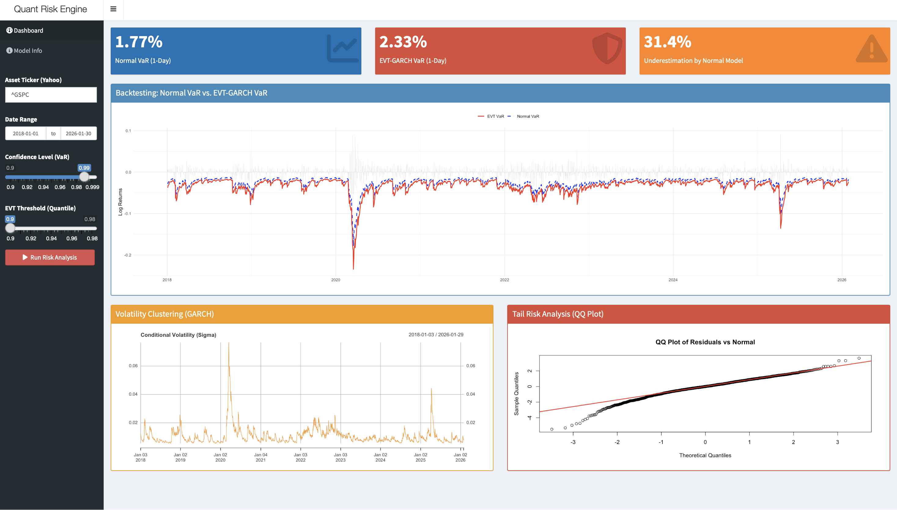

```markdown
# Market Risk Engine & Extreme Value Theory (EVT) Dashboard

A professional-grade **Risk Management System** built in **R** and **Shiny**. This project implements a hybrid **GARCH-EVT** model to estimate market risk, specifically designed to capture "Fat Tails" and extreme market events (Black Swans) that standard Normal distribution models fail to predict.

---

## Project Objective

Demonstrate the application of advanced quantitative methods in risk management by building a full-stack analytic engine that handles time-series analysis, statistical modeling, and real-time visualization:

1. **Core Engine (`Statistical Modeling`)**: A robust pipeline that tests for normality, filters volatility using GARCH, and models tail risk using Extreme Value Theory (EVT).
2. **Risk Quantification (`Metrics Engine`)**: Calculates regulatory-grade metrics including **Value at Risk (VaR)** and **Expected Shortfall (ES)** at high confidence levels (99%, 99.9%).
3. **Live Visualization (`Shiny Dashboard`)**: An interactive **R Shiny** application that allows users to backtest the model against any global asset (Stocks, Crypto, Forex) in real-time.

---

## Key Features

| Feature | Description | Technical Component |
| --- | --- | --- |
| **Volatility Filtering** | Removes volatility clustering from returns to produce i.i.d. residuals. | `rugarch` (GARCH 1,1) |
| **Tail Risk Modeling** | Focuses strictly on extreme losses using the **Peaks Over Threshold (POT)** method. | `evir` (GPD Distribution) |
| **Dynamic VaR** | Calculates a time-varying Value at Risk that adapts instantly to market turbulence. | Volatility Scaling |
| **Backtesting Engine** | visually compares the performance of Normal vs. EVT models against historical crashes. | `ggplot2` & `PerformanceAnalytics` |
| **Interactive UI** | Allows dynamic parameter tuning (Confidence Level, Threshold, Date Range). | `Shiny` & `Shinydashboard` |
| **Data Pipeline** | Fetches and processes adjusted closing prices from Yahoo Finance API. | `quantmod` & `xts` |

---

## Methodology

### 1. Data Preprocessing & Stylized Facts

* **Normality Test**: The engine first performs a Jarque-Bera test and Q-Q Plots to prove that asset returns are *not* Normally distributed (High Kurtosis).
* **Log Returns**: Prices are converted to Log Returns for additive properties and statistical stability.

### 2. GARCH Filtering (The "De-GarcHING")

* **Process**: Since EVT requires independent data, we use a **GARCH(1,1)** model to strip away the "Volatility Clustering" effect.
* **Output**: This produces "Standardized Residuals" (White Noise) which are the pure, random shocks required for the next step.

### 3. Extreme Value Theory (The Tail)

* **POT Method**: We apply the **Peaks Over Threshold** method. Only losses exceeding a specific quantile (e.g., 90%) are selected.
* **GPD Fit**: A **Generalized Pareto Distribution** is fitted to these excesses to mathematically describe the probability of a catastrophic loss.

### 4. Risk Calculation

* **Mechanism**: The static risk of the tail (from EVT) is recombined with the dynamic volatility (from GARCH) to produce a 1-day ahead forecast.

---

## Technologies Used

* **R 4.x** - Core Statistical Language
* `Shiny` / `Shinydashboard` - Interactive Web Framework
* `rugarch` - Univariate GARCH models
* `evir` - Extreme Value Analysis
* `quantmod` - Financial Data Acquisition
* `ggplot2` - Advanced Data Visualization

---

## Project Structure

```
Market-Risk-Engine-EVT/
│
├── app.R                 # The Full-Stack Application (UI & Server Logic)
├── README.md             # Documentation
└── R_Scripts/            # (Optional) Standalone analysis scripts
    ├── 01_Data_Analysis.R
    ├── 02_GARCH_Filtering.R
    └── 03_EVT_Modeling.R
```

---

## Installation and Usage

### Prerequisites

```bash
R (Version 4.0 or higher)
RStudio (Recommended)
```

### Usage Steps

**1. Install Dependencies**

Open R or RStudio and run the following command to install the necessary financial libraries:

```r
install.packages(c("shiny", "shinydashboard", "quantmod", "rugarch", "evir", "ggplot2", "PerformanceAnalytics"))
```

**2. Launch the Engine**

You can run the application directly from the terminal or R console:

```r
library(shiny)
runApp("app.R")
```

**3. Interact**

* Enter a Ticker (e.g., `^GSPC`, `BTC-USD`, `NVDA`).
* Adjust the **Confidence Level** (e.g., slide to 99.9% to see the Normal model fail).
* Click **"Run Risk Analysis"**.

---

## Preview

*Below is a screenshot of the Dashboard in action.



---

## Strengths & Limitations

### Strengths

* **Tail Sensitivity**: accurately captures "Black Swan" events where standard models underestimate risk.
* **Regulatory Compliance**: Aligns with **Basel III / FRTB** standards which favor Expected Shortfall (ES) and stress testing over simple VaR.
* **Adaptability**: The GARCH component ensures the model reacts immediately to changing volatility regimes.

### Limitations

* **Data Requirements**: EVT requires a significant history of data to find enough "extreme" points for a stable fit.
* **Complexity**: More computationally intensive than a simple Variance-Covariance matrix.

---

## Key Concepts

| Concept | Explanation |
| --- | --- |
| **VaR** | **Value at Risk**. The maximum expected loss over a given horizon at a specific confidence level (e.g., "We are 99% sure we won't lose more than X"). |
| **ES** | **Expected Shortfall** (or CVaR). The average loss *given* that the VaR threshold has been breached. Ideally suited for tail risk. |
| **GARCH** | A statistical model that estimates the volatility of returns based on historical volatility (volatility clustering). |
| **Heavy Tails** | A distribution where extreme outcomes (outliers) are more probable than in a Normal (Gaussian) distribution. |

---

## Resources and References

* **Quantitative Risk Management**: *Concepts, Techniques and Tools* - McNeil, Frey, & Embrechts.
* **Extreme Value Theory in Finance**: *An Introduction* - Paul Embrechts.
* **R Documentation**: [rugarch package](https://cran.r-project.org/web/packages/rugarch/index.html)
```
